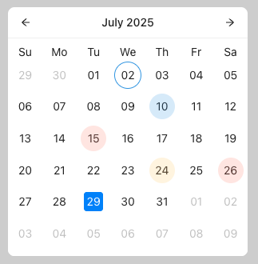

# Custom Calendar Component

A customizable calendar component built with React, TypeScript, Vite and Ant Design, featuring status indicators for specific dates.

## Features

- Displays a compact calendar view with navigation controls
- Visual indicators for dates with different statuses:
  - Declined (red)
  - Delayed (yellow)
  - On Track (blue)
  - Completed (green)
- Month navigation with arrow buttons
- Responsive design
